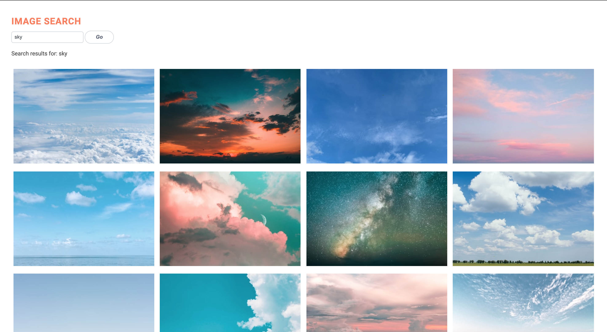

# App Objective

I wanted to display a single page of images fetched from [Unsplash API](https://unsplash.com/developers) and I created a React app using the [Create React App](https://github.com/facebook/create-react-app) command as I only needed one page and the initial feature-rich development environment helped with my learning. 



**Note: I have deleted the node modules so to run this in development mode [http://localhost:3000](http://localhost:3000) you need to first install the dependencies again, with `npm install` to be able to view it in the browser.**

**Also: You need to have Node.js and npm installed globally or on your local development machine.**


## To run locally

`$ cd HiPeople-ambarGalan-techTest` <br>
`$ npm install` <br>
`$ npm start` to go to `localhost:3000` <br>

## My process 

I used create-react-app to scaffold the project.

All the React code is in the `/src directory`.

---

I started off with the main App component in the `App.js` file and for me it was easier to put all the other components I would need in the same file and then, once they were all working, move them into their own component files to be loaded by the parent APP component.

Example of Class Component :
```
class App extends Component {
  render() {
    return (
      <div className="App">
        <h1>Hello, React!</h1>
      </div>
    )
  }
}
```

Since I needed to pull in API data I started off using Javascript's built-in Fetch to get the data from Unsplash's URL endpoint and display it. 

```
fetch('./data.json')
  .then(response => {
    return response.json()
  })
  .then(data => {
    // JSON data here
    console.log(data)
  })
  ```
---

I looked at the [Unsplash documentation](https://unsplash.com/documentation) and used this URL endpoint:
`https://api.unsplash.com/photos/?client_id=YOUR_ACCESS_KEY` to retrieve a list of photos.

Hitting the /photos endpoint would retrieve a list of photos. For each photo object returned the list of image URLs were returned under "urls" > raw, full, regular, small, thumb

```
{
  "urls": {
     "raw": "https://images.unsplash.com/photo-1461988320302-91bde64fc8e4?ixid=2yJhcHBfaWQiOjEyMDd9",
     "full": "https://images.unsplash.com/photo-1461988320302-91bde64fc8e4?ixid=2yJhcHBfaWQiOjEyMDd9&fm=jpg&q=80",
     "regular": "https://images.unsplash.com/photo-1461988320302-91bde64fc8e4?ixid=2yJhcHBfaWQiOjEyMDd9&fm=jpg&fit=crop&w=1080&q=80&fit=max",
     "small": "https://images.unsplash.com/photo-1461988320302-91bde64fc8e4?ixid=2yJhcHBfaWQiOjEyMDd9&&fm=jpg&w=400&fit=max",
     "thumb": "https://images.unsplash.com/photo-1461988320302-91bde64fc8e4?ixid=2yJhcHBfaWQiOjEyMDd9&fm=jpg&w=200&fit=max"
  },
  ```
---

I started using the React lifecycle method `componentDidMount()`. Lifecycle is the order in which methods are called in React. This method makes sure the component has rendered to the DOM tree before invoking the data/code.

I first tested it with a hardcoded query:
`https://api.unsplash.com/photos/?query=houseplants&client_id=YOUR_ACCESS_KEY`

* I fetched the API data using the URL endpoint and within the lifecycle method
* It returned the JSON results
* I mapped over the data
* Set a key to select and then specified the data object (React uses the key attribute to ensure that DOM elements correspond with data objects)
* Set the state with `this.setState` because the initial image state in the App component starts as an empty array
* Finally, the render method is used in order to display the content. Class components are the ones that use the render method. 

The best way to display the images was to create new `PhotoList` component and pass it down as props.  

---

**Note: All my other components started out as Class components. I changed the other components into functional components since I only needed to change the state within the Class App component**

`Before as a class component:`
```
 class PhotoList extends Component {
   render() {
     const { images } = this.props;
     return (
       <ul>
         {images.map((image, index) => {         
           return (
             <Photo key={index} url={image.urls.thumb} />
           );
         })}
       </ul>
     );
   }
 }
```

I moved the mapp array method from the App component into my PhotoList component. The return value for every object was mapped through becomes a new instance of the Photo component. Each Photo will have a prop on it labelled, url, which will be used in our Photo component.

`Before as a class component:`
```
class Photo extends Component {
    render() {
      
      return (
        <li>
          
        </li>
      );
    }
  }
```

I then made Photo into a functional component that returned an image. The src of this image is the url that has been attributed to what was passed down through props.

---

Now that images could be called and rendered, instead of hardcoding the query, I wanted to set up a search form to be able to change the query endpoint. 

```
  componentDidMount() {
    // const url = `https://api.unsplash.com/search/photos/?page=1&per_page=20&query=${this.state.searchText}&client_id=YOUR_ACCESS_KEY`;
    // fetch(url)
    //   .then((result) => result.json())
    //   .then((data) => {
    //     this.setState({
    //       images: data.results,
    //     });
    //   });
  }
```
---

I looked at the **Parameters** in the Unsplash documentation API:

param | Description
--- | --- 
`query` | Search terms.
`page` | Page number to retrieve. (Optional; default: 1) 
`per_page` | Number of items per page. (Optional; default: 10)
`order_by` | How to sort the photos. Optional. (Valid values: latest, oldest, popular; default: latest)

I used a single page parameter with `page` that would retrieve 20 items `per_page` and a `query` param so that, in the end, my endpoint looked like this:

`https://api.unsplash.com/search/photos/?page=1&per_page=20&query=${this.state.searchText}&client_id=YOUR_ACCESS_KEY`

---

The App would pass a prop function to my new Search component and update `searchText` state on submit. Once the `searchText` state updated I made a request to the API which, when it returned the data, then updated the `photos` state. Since `ComponentDidMount` is called after the data is fetched, I needed another lifecycle method which would update the new props from the parent. The data was being called but the images weren't updating. Using `componentWillUpdate` set the state based on the response and caused an infinite loop in the DOM load.

I was using `searchTerm` in a state in the APP component. A function was passing down as a prop to the Search component to update the App's state but that would of meant passing it up to the parent App to make the API request. That would also have meant needing to use `shouldComponentUpdate`. Since `searchTerm` ultimately wasn't being used for anything else it didn't need to be kept in a state at all.

This is why, in the end, `componentDidMount()` became the function:

```
updatePhotos = (searchTerm) => {
    
    const url = `https://api.unsplash.com/search/photos/?page=1&per_page=20&query=${searchTerm}&client_id=YOUR_ACCESS_KEY`;

    fetch(url)
      .then((result) => result.json())
      .then((data) => {
        this.setState({
          images: data.results,
        });
      });
```
---

Finally, I used CSS grid to create a simple and clean page design to render the list of images on the page. This is responsive so the grid shows four images in a row when on a desktop, two when using a tablet and one full image on a mobile device. 

---

## What I learnt

I hadn't used React for any of my previous projects before but I was able to pick it up and attempt this React app since I already had basic knowledge in:

* HTML & CSS
* JavaScript and programming thinking
* ES6 syntax
* the DOM
* APIs and REST 
* MVC

Before attempting to fetch API, I first read documentation and followed tutorials to build a simple To-Do app  which helped me understand the essential concepts and terms, such as Babel, Webpack, JSX, virtual DOM, components, props, states and lifecycle.

I made sure my text editor was using the “Babel” language definition so that both ES6 and JSX code could be properly highlighted (especially as I was starting out with React!).

### New learning

I had to get my head around using JSX syntax, which looks similar to HTML, but soon understood it produces React 'elements' which renders them to the DOM. I could include JavaScript expressions inside curly braces in JSX. I also learnt that React DOM uses the camelCase naming convention and noticed that `class` became `className`, `onclick` became `onClick` and self closing tags needed to end in a slash `/>`.

### Issues I encountered

After figuring out how to create components, rendering and mapping through state arrays I then had to understand how lifecycle methods worked, especially when implementing the additional search component. The user would have to type in an input, the change would trigger a `setState()`, and the state would re-define the input value. 

Example:
```
class SearchBar extends Component {
 constructor(props) {
 super(props)
 this.state = { term: '' };
 }
 render() {
 return (
 <input
 value={this.state.term}
 onChange={event => this.setState({term: event.target.value})} />
 );
 }
}
```
I would then map over an array of props, pass props to the children and need a unique key by the child (which is in the `PhotoList `component).

Since I started out with these states:
```
state = {
    images: [],
    searchText: "",
  };
```

I had to work out the life of the component when it was inserted into the DOM. `componentDidMount()` didn't work with my code when I wanted to update the child props from its parent. I encountered the problem of an infinite loop in the DOM load which worked out when changing the method in the App into a function.

### CSS

Every photo in the API is a completely different size, so when using grid (because I wanted to make it responsive) there were a lot of unwieldy blank spaces around the page. I had to force the images into squares to make the page look cleaner. With more time, I would of liked to add the function of clicking on an image and making it bigger, but this would of required to go to a different URL page and I was only working on a single page with this App.

### API Access key

Unsplash gives you an access key and a secret key. I didn't have time to figure out how to use the secret key so I have used my access key within the App. I wanted to find a way to 'hide' the key as having it within the code isn't best practise. When using Ruby on Rails, I would place any keys within a secter `.env` folder which, I found out, isn't used the same in React. I haven't yet discovered the best way to implement a hidden key but for now this is pasted as is within my App.

**Note: This access key will be revoked in the next week.**

### Tests

I didn't have time to learn and properly run tests in React but am currently researching this and further React aspects and would love to learn best practises.

---

## Helpful links and documentation

These are the documentations and tutorials which helped me quickly pick up and understand React before building this App:

The [React](https://reactjs.org/) documentations was very thorough, especially the [tutorial](https://reactjs.org/tutorial/tutorial.html) where I built an interactive tic-tac-toe game. The [step-by-step](https://reactjs.org/docs/hello-world.html) guide helped me start thinking more in React, especially the Component and Lifecycle [sections](https://reactjs.org/docs/react-component.html)

I built a To-Do app following this [guide](https://www.taniarascia.com/getting-started-with-react/) which helped reinforce the basic React concepts.

I also looked at the Facebook [create-react-app](https://github.com/facebook/create-react-app) documentation.

---

### Thank you !